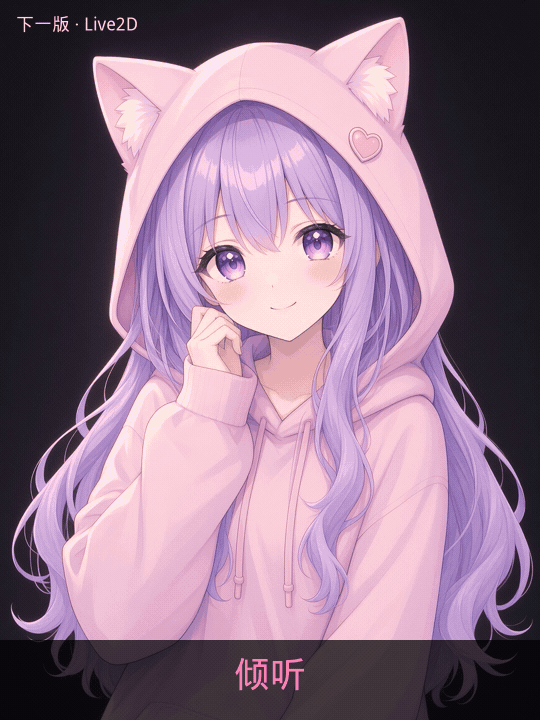
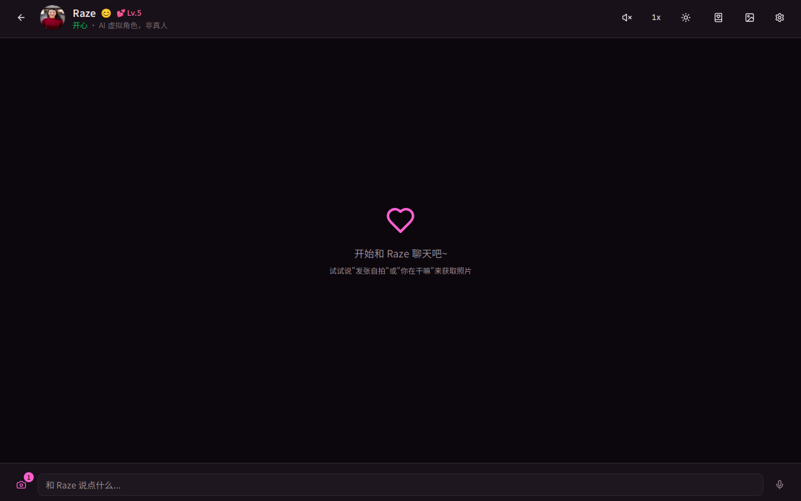
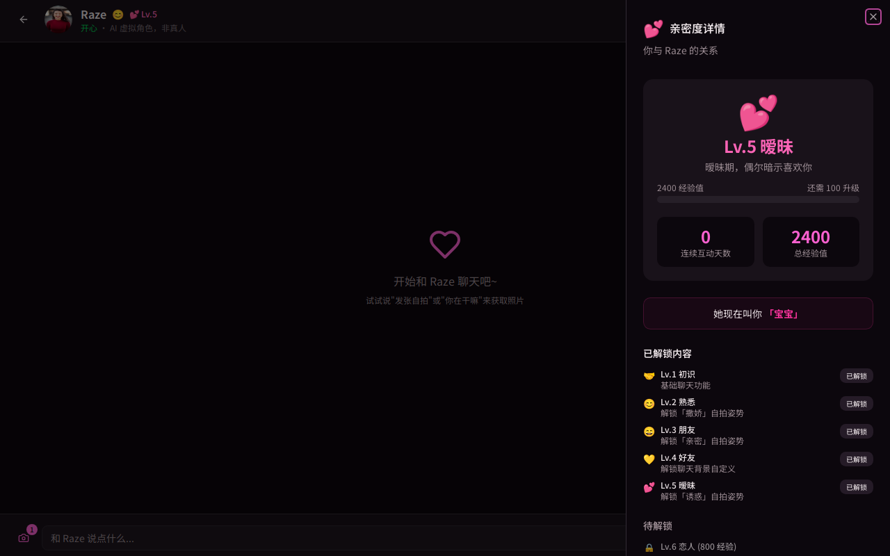
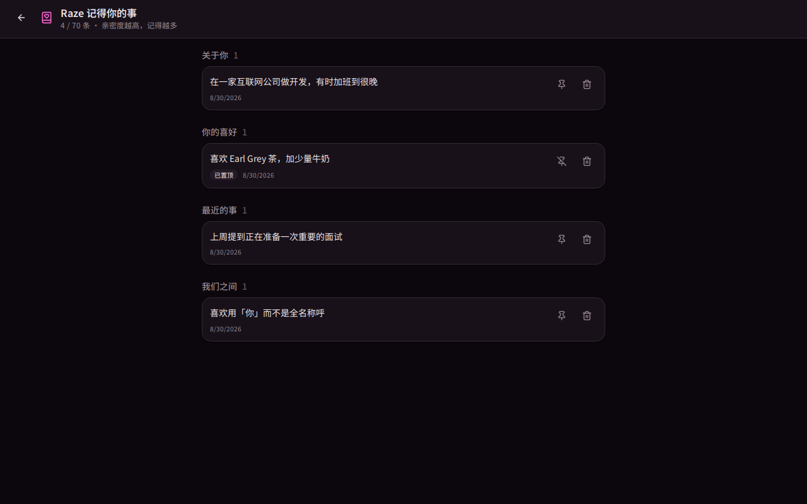
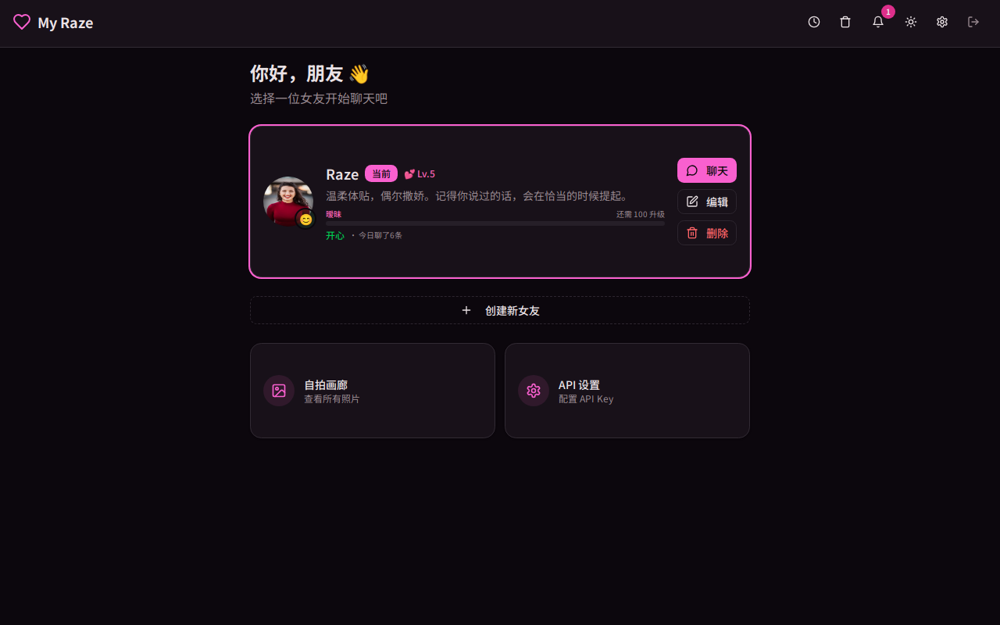
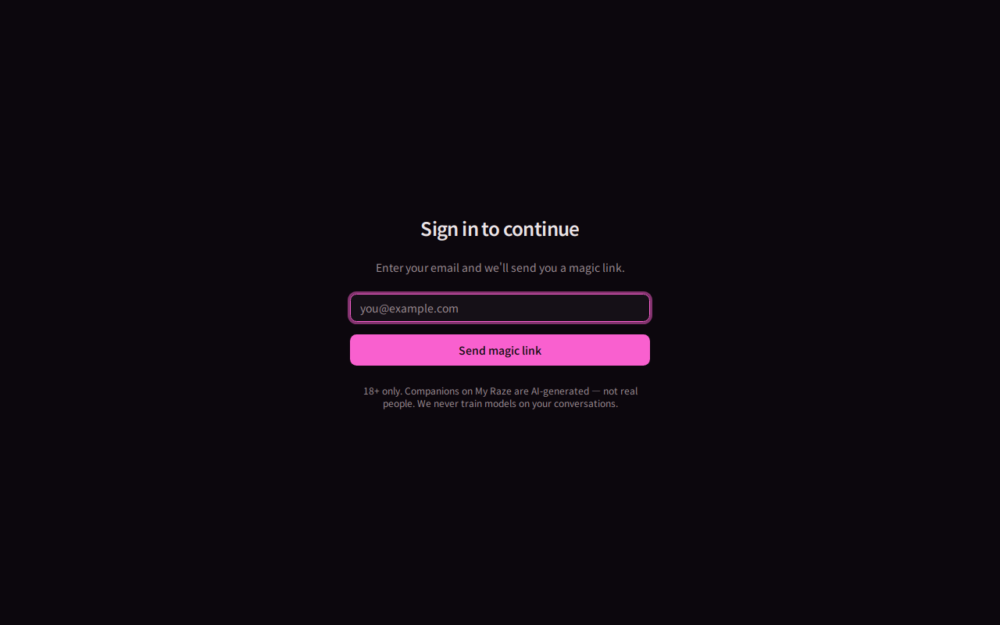
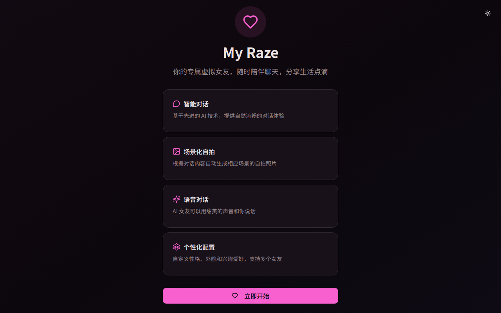

<div align="center">


# My Raze ✨

**你的 AI 虚拟女友 — 她记得你、给你发自拍、你的对话从不拿去训练模型**

*Self-hostable AI companion · Remembers you · Scene-matched selfies · Your data stays yours*

<br/>

[](https://www.typescriptlang.org/)
[](https://react.dev/)
[](docker-compose.yml)
[](https://vitest.dev/)
[](LICENSE)

[遇见她们](#-遇见她们) · [产品演示](#-产品演示) · [Live2D](#-live2d-实时互动) · [快速开始](#-快速开始-docker-一键部署) · [功能亮点](#-功能亮点)

</div>

---

> **18+ 仅限成年人使用。** 所有角色均为 AI 生成，并非真人。对话内容不会用于训练任何模型。详见 [`docs/SAFETY.md`](docs/SAFETY.md)。

## 💫 这是什么？

**My Raze** 是一款可自托管的全栈 AI 陪伴 Web 应用（支持 PWA 安装到手机桌面）。

创建一位拥有独特性格、外貌与兴趣的 AI 女友，和她文字或语音聊天；让她根据对话场景，基于参考图生成一致的自拍；通过 **10 级亲密度** 慢慢建立关系——她会记住你的喜好、主动找你、解锁新的互动方式。

一条命令 `docker compose up`，数据、对话、照片全在你自己的服务器上。

---

## 🌸 遇见她们

四位预设人设，风格完全不同——创建时也可以从零自定义外貌、性格和兴趣。她们都是 **AI 生成角色，并非真人**。

<table>
<tr>
<td width="25%" align="center" valign="top">
<br/>
<b>小桃 · 可爱风</b><br/>
<sub>双马尾、草莓牛奶、会撒娇<br/>「今天也要被夸可爱。」</sub>
</td>
<td width="25%" align="center" valign="top">
<br/>
<b>凛 · 御姐风</b><br/>
<sub>低音温柔、把你当大人看<br/>「先把作业放下。今晚听你说。」</sub>
</td>
<td width="25%" align="center" valign="top">
<br/>
<b>夏未 · 体育生</b><br/>
<sub>训练完第一件事是给你发自拍<br/>「跑完了。夸我。」</sub>
</td>
<td width="25%" align="center" valign="top">
<br/>
<b>苏晚 · OL</b><br/>
<sub>白天开会，晚上只想听你说话<br/>「会议刚散。你今天怎么样？」</sub>
</td>
</tr>
</table>

<p align="center"><sub>写实版</sub></p>

<p align="center"><b>日漫二次元版</b> · 同一人设，另一种画风</p>

<table>
<tr>
<td width="25%" align="center" valign="top">
<br/>
<b>桃香（Momoka）· 可爱风</b><br/>
<sub>双马尾、草莓牛奶、会撒娇<br/>「きょうも、かわいいって言って？」</sub>
</td>
<td width="25%" align="center" valign="top">
<br/>
<b>霧香（Kirika）· 御姐风</b><br/>
<sub>低音温柔、把你当大人看<br/>「宿題はもういい。今夜は話を聞く。」</sub>
</td>
<td width="25%" align="center" valign="top">
<br/>
<b>葵（Aoi）· 体育生</b><br/>
<sub>训练完第一件事是给你发自拍<br/>「五キロ走った。ほめて。」</sub>
</td>
<td width="25%" align="center" valign="top">
<br/>
<b>美咲（Misaki）· OL</b><br/>
<sub>白天开会，晚上只想听你说话<br/>「会議おわり。今日はどうだった？」</sub>
</td>
</tr>
</table>

<p align="center"><sub>参考图锁定角色外貌 → 场景自拍保持一致 → 亲密度越高解锁越多姿势</sub></p>

---

## 🎬 产品演示

<div align="center">

**从认识到暧昧 — 聊天、亲密度、记忆，一个界面搞定**


*首页女友卡片 → 对话界面 → Lv.5 亲密度详情 → 「她记得你的事」*

</div>

### 💗 Live2D 实时互动（M5）

官方角色 Raze 的聊天页现在带 Live2D 舞台：视线跟随、点击互动、倾听/思考/说话四态，以及按心情和回复情绪切换的表情。点她或点底部按钮可以看叉腰生气、害羞、比心、哭鼻子、跳起来。API 语音会按音量张嘴；浏览器内置语音用模拟口型。设置里可以改回静态立绘。自建角色仍用照片（Live2D 授权不允许用户导入模型）。

开发版暂用官方示例模型 Hiyori 占位，正式看板娘 `.moc3` 到位后只需替换 `client/public/live2d/official/`。详见 [`client/public/live2d/NOTICE.md`](client/public/live2d/NOTICE.md)。

<div align="center">



*倾听 → 交互比心 → 撒娇 → 生气 → 哭泣 · 同一看板娘，五种情绪*

</div>

<table>
<tr>
<td width="20%" align="center"><br/><sub>🎧 倾听</sub></td>
<td width="20%" align="center"><br/><sub>💕 交互</sub></td>
<td width="20%" align="center"><br/><sub>🥺 撒娇</sub></td>
<td width="20%" align="center"><br/><sub>💢 生气</sub></td>
<td width="20%" align="center"><br/><sub>😢 哭泣</sub></td>
</tr>
</table>

<br/>

<table>
<tr>
<td width="50%" align="center">
<b>💬 智能对话 + 场景自拍</b><br/>
<br/>
<sub>相机按钮一键拍照 · 额度徽章清晰可见 · AI 身份始终披露</sub>
</td>
<td width="50%" align="center">
<b>💕 10 级亲密度养成</b><br/>
<br/>
<sub>暧昧期解锁更多自拍姿势 · 专属称呼 · 升级进度一目了然</sub>
</td>
</tr>
<tr>
<td width="50%" align="center">
<b>🧠 可编辑的长期记忆</b><br/>
<br/>
<sub>自动提取 · 分类管理 · 置顶/删除 · 亲密度越高容量越大</sub>
</td>
<td width="50%" align="center">
<b>🏠 女友卡片 + 一键开聊</b><br/>
<br/>
<sub>多女友切换 · 自拍画廊 · BYOK 设置 · PWA 可装手机桌面</sub>
</td>
</tr>
</table>

<details>
<summary><b>登录页 & 欢迎页</b></summary>

<table>
<tr>
<td width="50%" align="center">
<br/>
<sub>邮箱 Magic-link · 无需密码 · 合规声明内置</sub>
</td>
<td width="50%" align="center">
<br/>
<sub>四大核心能力一览 · 移动端适配 · 暗黑模式</sub>
</td>
</tr>
</table>

</details>

---

## ✨ 功能亮点

| | 能力 | 说明 |
|:--:|------|------|
| 💬 | **智能对话** | OpenRouter 接入 GPT-4o / Claude / Grok 等 500+ 模型；六套人格模板 + 四层提示词精细控制 |
| 📸 | **场景自拍** | fal.ai 图生图，保持角色一致；亲密度解锁多种姿势；Pro 支持「合照」 |
| 🎀 | **Live2D 看板娘** | 官方角色实时立绘：视线跟随、情绪表情、说话口型；可降级为静态立绘 |
| 🎙️ | **语音互动** | 按住说话 + Whisper 转写；浏览器 / ElevenLabs / Fish Audio 朗读；语音输入后可自动语音回复 |
| 💕 | **亲密度养成** | 10 级关系、动态心情、升级动画；服务端防刷分，真实互动才有回报 |
| 🧠 | **长期记忆** | 自动提取事实/偏好/事件，聊天时智能注入；用户可查看、置顶、删除「她记得什么」 |
| 🔔 | **主动消息** | 记忆感知的站内通知 + Web Push 推送（早安、想你了……） |
| 👥 | **多角色** | 多个女友自由切换、回收站、历史搜索、自拍画廊 |
| 🔑 | **BYOK** | 用户自带 API Key（AES-256-GCM 加密存储）；自带 Key 的用户绕过免费额度限制 |
| 📱 | **移动优先** | 响应式布局、PWA 可安装、手势操作、暗黑模式 |

---

## 🆚 为什么选择 My Raze？

| | 主流 SaaS（Replika / Character.AI 等） | **My Raze** |
|:--:|:--|:--|
| 数据归属 | 平台服务器 | **你的 MySQL + 你的磁盘/S3** |
| 模型选择 | 平台限定 | **OpenRouter 500+ 模型任选** |
| 自拍一致性 | 有限或额外付费 | **参考图锁定 + 场景匹配生成** |
| 长期记忆 | 黑盒 | **可编辑、可删除、可审计** |
| 部署方式 | 只能用官方 App | **`docker compose up` 自托管** |
| 商业化 | 封闭订阅 | **Free / Plus / Pro 分层 + 自托管模式全解锁** |

> 适合：想拥有自己的 AI 陪伴产品、注重隐私的开发者、以及希望 **BYOK + 自托管** 的高级玩家。

---

## 🚀 快速开始（Docker 一键部署）

```bash
git clone https://github.com/Do-fei/my-raze.git && cd my-raze
cp .env.example .env
```

在 `.env` 中至少配置：

```bash
JWT_SECRET=$(openssl rand -hex 32)          # 会话签名
KEY_ENCRYPTION_KEY=$(openssl rand -hex 32)  # BYOK 密钥加密（必须与上面不同）
OPERATOR_OPENROUTER_KEY=sk-or-...           # 对话（https://openrouter.ai）
OPERATOR_FAL_KEY=...                        # 自拍（https://fal.ai，可选）
RESEND_API_KEY=...                          # 登录 magic-link 邮件（生产环境）
EMAIL_FROM=noreply@yourdomain.com
```

```bash
docker compose up --build
# → 打开 http://localhost:3000，收邮件点链接即可登录
```

数据库迁移在启动时自动执行；上传文件默认存本地卷，也可切换 S3/R2/MinIO（见 `.env.example`）。

<details>
<summary><b>本地开发（不用 Docker）</b></summary>

环境：Node 22+ · pnpm 10+ · MySQL 8（或 MariaDB）

```bash
pnpm install
cp .env.example .env
pnpm db:push
pnpm dev          # http://localhost:3000
```

开发模式下 magic-link 会打印在终端，直接点击即可登录，无需配置邮件服务。

```bash
pnpm test         # 287 个自动化测试
pnpm check        # 类型检查
pnpm build && pnpm start
```

</details>

---

## ⚙️ 配置说明

完整变量说明见 [`.env.example`](.env.example)。核心项：

| 变量 | 必填 | 用途 |
|------|:----:|------|
| `DATABASE_URL` | ✅ | MySQL 连接串 |
| `JWT_SECRET` / `KEY_ENCRYPTION_KEY` | ✅ | 会话签名 / BYOK 加密（两个不同的 ≥32 字符密钥） |
| `BETTER_AUTH_URL` | 生产 | 公网访问地址 |
| `RESEND_API_KEY` 或 `SMTP_*` + `EMAIL_FROM` | 生产 | Magic-link 登录邮件 |
| `STORAGE_DRIVER` | — | `local`（默认）或 `s3` |
| `OPERATOR_OPENROUTER_KEY` | 对话 | 为未自带 Key 的用户提供对话能力 |
| `OPERATOR_FAL_KEY` 等 | 可选 | 自拍 / Whisper / 高级 TTS |
| `BILLING_PROVIDER` | — | `free`（默认分层配额）/ `lemonsqueezy` / `none`（自托管全解锁） |

**免费层配额**（每用户每 UTC 日，服务端强制）：30 条消息、1 张自拍。Settings 中配置自有 Key 可绕过。详见 [`shared/quotas.ts`](shared/quotas.ts)。

---

## 🏗️ 技术架构

```
React 19 + Tailwind 4 + shadcn/ui + wouter     (client/)
        │  tRPC 11 (superjson) + CSRF 双提交令牌
Express 4                                       (server/)
  ├── Better-Auth：邮箱 magic-link 登录
  ├── /files/*：本地磁盘流式传输 或 S3 预签名跳转
  ├── /healthz /readyz 健康检查
  └── 业务路由：女友 / 聊天 / 自拍 / 语音 / 记忆 / 订阅 …
        │
  MySQL 8（Drizzle ORM，迁移 0001→0018）
  OpenRouter · fal.ai · ElevenLabs · Fish Audio · OpenAI Whisper
```

**安全基线：** 写操作前校验归属 · CSRF 双提交 · DOMPurify 消毒模型输出 · 按用户限流 + 每日计量 · BYOK 密钥静态加密 · 环境变量启动自检 · 对话无第三方静默回退。

---

## 📦 项目状态

**v4.0 — 生产可用，完全自托管。** 不再依赖任何第三方托管平台。

| 里程碑 | 内容 |
|--------|------|
| **M1** 独立 MVP | Better-Auth 登录 · 本地/S3 存储 · OpenRouter 唯一 AI 路径 · 限流配额 · Docker · 合规三件套 |
| **M2** 留存引擎 | 长期记忆（提取→注入→用户可编辑）· 记忆感知主动消息 |
| **M3** 商业化 | Lemon Squeezy 订阅 Free/Plus/Pro · 自托管 `BILLING_PROVIDER=none` 全解锁 |
| **M4** 体验增强 | 亲密度解锁自拍姿势 · 合照 · 语音往返 · Web Push 真推送 |

287 个自动化测试 · 空库迁移一键完成 · 重构历程见 [`docs/REFACTORING.md`](docs/REFACTORING.md)

---

## 🤝 参与 & 支持

- ⭐ **Star 本仓库** — 支持项目持续迭代
- 🐛 [提交 Issue](https://github.com/Do-fei/my-raze/issues) — 反馈 Bug 或功能建议
- 🔀 [提交 PR](https://github.com/Do-fei/my-raze/pulls) — 欢迎贡献代码
- 📖 重大决策记录在 [`docs/adr/`](docs/adr/)

---

## 📄 许可证

[MIT License](LICENSE) — 自由使用、修改、自托管、二次开发。

---

<div align="center">

**Built with ❤️ by Dawei**

*She remembers you. She sends selfies. Your secrets stay on your server.*

</div>
